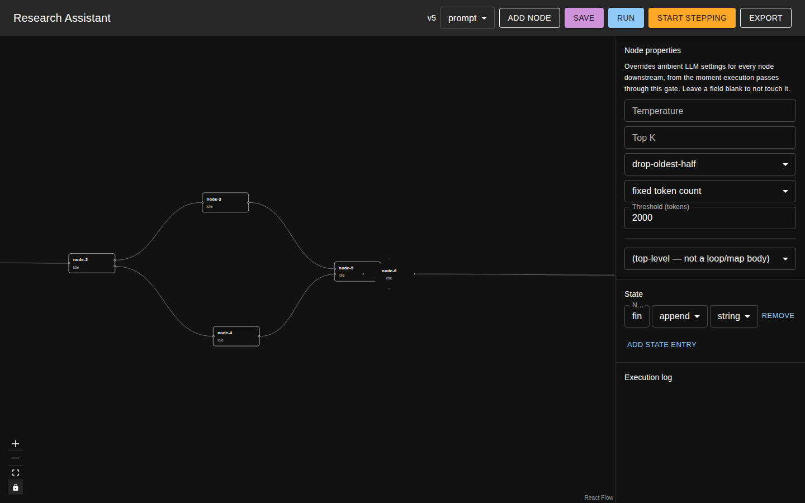

# flowlathe

> A graphical builder and visual compiler for LLM workflows, built for local models.

Most visual LLM workflow tools (Flowise, n8n, LangFlow) are built around hosted frontier
models, where one call usually solves the whole problem and concurrency just means "fire
everything at once." flowlathe targets the opposite situation: a workstation with one or two
GPUs running small local models, where solving a frontier-grade problem means decomposing it
into many small, individually tractable steps — and where VRAM and model-swap thrash, not API
rate limits, are the binding constraint.



## What it is

flowlathe is a canvas-based flow builder plus a small runtime and compiler:

- **Draw a graph** of prompt, router, merge, loop, map, gate, pause, and user-input nodes,
  wired together with typed ports carrying immutable values.
- **Run it** against local (Ollama) or OpenAI-compatible providers, with real per-node
  parallelism and a scheduler that batches work by model instead of just maximizing
  concurrency.
- **Debug it step by step** — step forward, step back with a forked branch, edit a prompt
  mid-run, and re-run from that point without losing the original branch.
- **Export it** to a standalone, dependency-free TypeScript script. The canvas is for
  building and debugging; the exported script is the deterministic, version-controllable
  artifact you actually ship.

See [`documentation/WALKTHROUGH.md`](documentation/WALKTHROUGH.md) for a full walkthrough
with screenshots of every feature described below.

## Key features

- **Ports + edges, not a shared blackboard.** Edges carry immutable values port-to-port, so
  fan-out (router, map) is race-free and every value's lineage is visible in the graph.
- **Declared State.** Named, typed state entries with a merge rule (`replace`, `append`, …)
  live alongside the graph for values that need to accumulate across nodes rather than flow
  through a single edge; a node opts in to a built-in `read_state`/`write_state` tool to touch
  them.
- **Ambient per-node context.** Every prompt node automatically accumulates its own
  conversation history (the messages it has sent and received) across activations — including
  each iteration of a loop or map body — with no wiring required.
- **The Gate node.** A diamond-shaped node that overrides ambient LLM settings — temperature,
  top-k, and context-compaction method/threshold — for every node wired downstream of it, from
  the moment execution passes through it. It always wins over a node's own local setting,
  making "everything after this point gets more conservative / gets compacted" a single node
  instead of per-node configuration.
- **Context compaction.** When a Gate sets a compaction method (`drop-oldest-half` or
  `summarize-oldest-half`) and a threshold (fixed token count or percentage of context window),
  a node's accumulated context is compacted once it crosses that threshold. `system`-role
  messages are never dropped.
- **Step debugging with branching.** Run, step back to any prior node, edit something, and
  step forward — this forks a new branch from that point while the original run stays intact
  and inspectable.
- **Model-affinity scheduling.** The scheduler batches queued work by which model it needs,
  rather than firing every ready node at once — important when only one or two large local
  models fit in VRAM simultaneously.
- **Compile to a standalone script.** Any flow can be exported as a self-contained TypeScript
  program built on `@flowlathe/runtime` and `@flowlathe/providers` — no server or canvas
  required to run it again.
- **MCP tool servers.** Point flowlathe at an `mcpServers` config file (the same shape Claude
  Desktop/Code use) to connect stdio, SSE, or Streamable HTTP MCP servers; each server's tools
  become a toolset a prompt node opts into, the same way as the built-in state tools or a
  plugin. Tool names/descriptions are sanitized before they ever reach a model's context.

## Tech stack

- **Server:** Node 22, Fastify, SQLite via Drizzle, Server-Sent Events for live execution logs.
- **Web:** React 18, MUI 9, `@xyflow/react` (React Flow) for the canvas, Vite.
- **Providers:** Ollama and OpenAI-compatible HTTP APIs, plus a deterministic Mock provider for
  testing and demos.
- **Monorepo:** pnpm workspaces + Turborepo. Packages: `core`, `interpreter`, `compiler`,
  `runtime`, `providers`, `persistence`, `server`, `web`, `testing`, one package per node kind
  under `packages/nodes/*`, and one package per plugin (Spotify, MCP) under `packages/plugins/*`.
- **Tools/MCP:** `@modelcontextprotocol/sdk` for the MCP client (stdio, SSE, and Streamable
  HTTP transports).
- **Testing:** Vitest for unit/integration tests, Playwright for end-to-end tests.

## Quickstart

Requires Node ≥ 22 and pnpm.

```bash
pnpm install
pnpm build
node packages/server/dist/index.js
```

Then open `http://127.0.0.1:4310`. By default the server keeps its SQLite database under
`packages/server/data/`; set `FLOWLATHE_DB_PATH` and `PORT` to override the database location
and port respectively.

A **Mock** provider (which echoes its prompt back, prefixed with `[provider:model]`) is
seeded automatically, so you can build and run a flow end-to-end with no local model server
running. Add an **Ollama** or **OpenAI-compatible** provider from the Providers page once
you're ready to point a flow at a real model.

For local development with hot reload:

```bash
pnpm dev
```

To connect MCP tool servers, set `MCP_SERVERS_CONFIG_PATH` to a JSON file shaped like:

```json
{
  "mcpServers": {
    "my-server": { "command": "npx", "args": ["-y", "some-mcp-server"] },
    "remote-server": { "url": "https://example.com/mcp" }
  }
}
```

A stdio server (one with a `command`) only runs if its command is also listed in
`MCP_ALLOWED_COMMANDS` (comma-separated) — unset means none may run. Each server's tools are
discovered once at server startup and exposed as the toolset `mcp:<name>`; check
`/api/plugins/status` (or the workflow-dependency banner on the canvas) if a server fails to
connect.

## Known v1 limitations

- Compiled-script export only special-cases router branches that are exactly one node deep
  before reconverging — anything further downstream in an untaken branch is emitted as an
  unconditional call and throws at runtime; the interpreter itself has no such limit (it
  propagates a `never` port-slot arbitrarily deep). Fixing this means replacing the
  compiler's flat statement-emission pass with a real dominator/dominance-frontier walk so an
  entire conditionally-executed subtree — not just the direct branch target — gets guarded;
  see `packages/compiler/src/compile-graph.ts`'s `emitSequential`.
- Loop/Map bodies are a single node (which can itself be any node kind), not an arbitrary
  subgraph. Both the interpreter and the compiler assume exactly one child node per
  Loop/Map `parentId` and never index edges between body nodes; supporting a real subgraph
  body means embedding a second, nested instance of the graph-execution engine inside
  loop/map dispatch in both `packages/interpreter/src/run-graph.ts` and
  `packages/compiler/src/compile-graph.ts`, kept in parity.

## Repository layout

```
packages/
  core/          zero-I/O contracts and graph types, shared by server and browser
  interpreter/   the graph engine that drives node dispatch and readiness
  compiler/      graph -> standalone TypeScript export
  runtime/       context, state, and LLM-config stores; the pieces an exported script imports
  providers/     Mock, Ollama, and OpenAI-compatible provider adapters
  persistence/   SQLite schema and migrations (Drizzle)
  server/        Fastify API + SSE, serves the built web SPA
  web/           the canvas SPA (React + React Flow)
  nodes/*/       one package per node kind (prompt, router, merge, loop, map, gate, ...)
  testing/       shared test fixtures and the interpreter/compiler parity harness
playwright/      end-to-end tests
documentation/   walkthrough and screenshots
```
