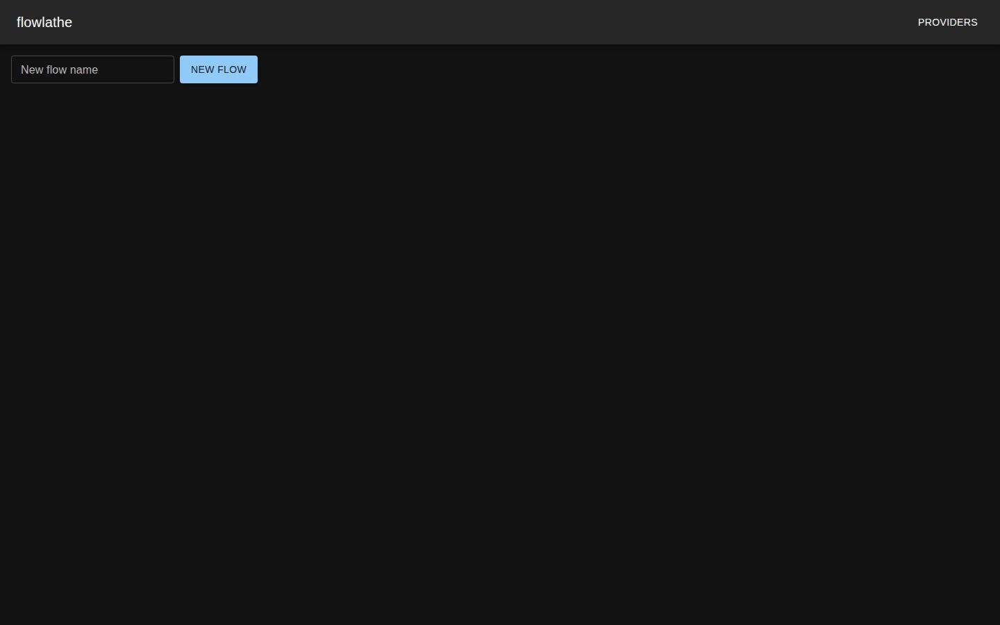
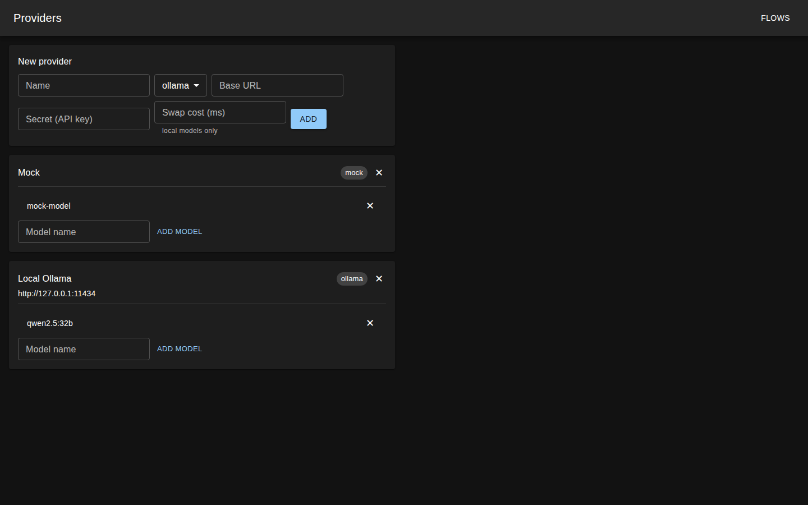
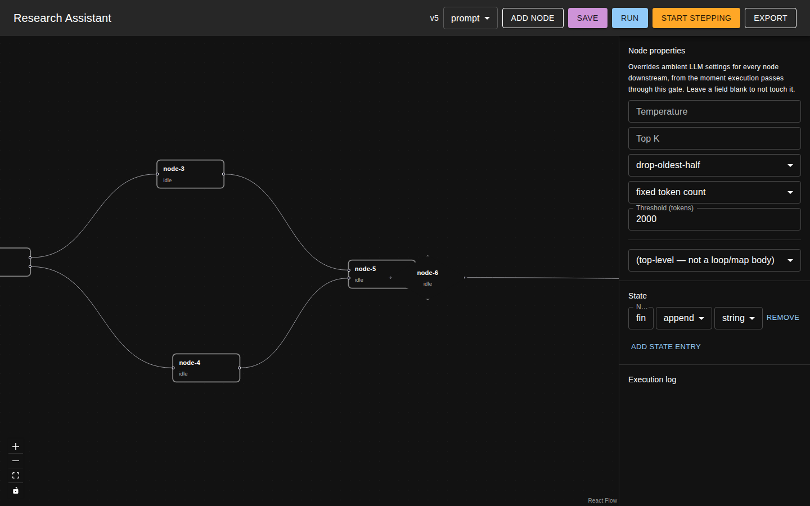
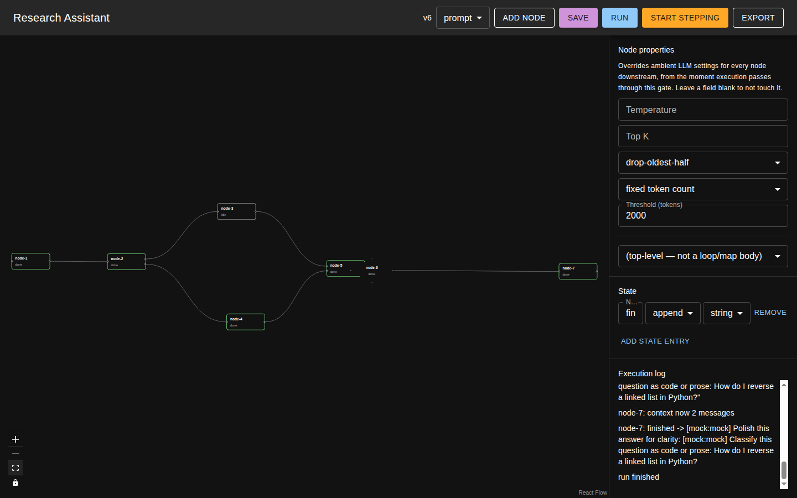
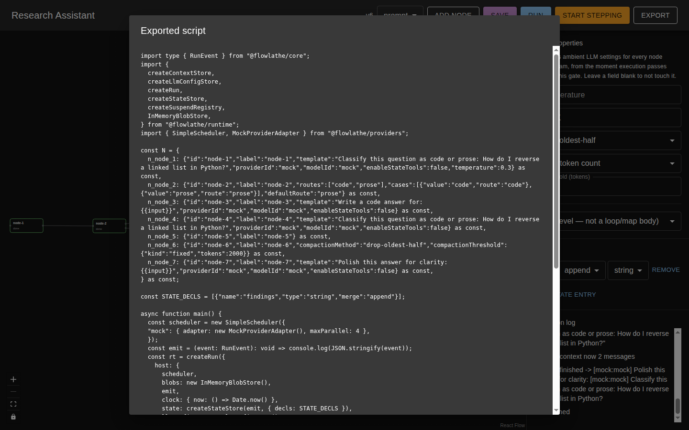

# Walkthrough

This walks through building, running, and exporting a small but realistic flow —
**Research Assistant** — that touches most of flowlathe's features: a router with two
parallel branches, a merge, declared State, the Gate node, ambient per-node context, and
compiled-script export.

The flow classifies a question as "code" or "prose", routes it to a matching prompt, merges
the branches back together, passes the result through a Gate that lowers the temperature and
turns on context compaction for everything downstream, and finishes with a polish prompt.

## 1. Start from an empty flow list

Every flow you create shows up here. Give a new flow a name and click **New Flow** to open
it on the canvas.

## 2. Set up providers

Before wiring a graph, add the providers your prompt nodes will call. A **Mock** provider
(with a `mock-model` model) is seeded by default — it echoes its prompt back prefixed with
`[provider:model]`, which makes it useful for building and testing a flow's *shape* without
a model server running. Add a real provider (here, a local **Ollama** instance running
`qwen2.5:32b`) when you're ready to point a flow at an actual model.

## 3. Build the graph

Add nodes from the **New node kind** dropdown and **Add Node**, then drag between each
node's handles to wire them. This flow has seven nodes:

1. **node-1** (prompt) — the seed prompt: a literal question, no upstream input.
2. **node-2** (router) — classifies the question and routes to `"code"` or `"prose"`.
3. **node-3** (prompt) — the code-answer branch.
4. **node-4** (prompt) — the prose-answer branch.
5. **node-5** (merge) — joins whichever branch ran back into one value.
6. **node-6** (gate) — the diamond-shaped node; see step 4.
7. **node-7** (prompt) — polishes the merged answer for clarity.

A declared **State** entry, `findings` (merge rule `append`), sits alongside the graph —
visible in the right-hand panel regardless of which node is selected — for values that
should accumulate across the run rather than travel through a single edge.

## 4. Configure the Gate

The **Gate** is flowlathe's mechanism for saying "everything downstream of this point should
behave differently," without touching every node individually. Click it to see its panel:
temperature, top-k, a compaction method (`drop-oldest-half` or `summarize-oldest-half`), and
a compaction threshold (fixed token count, or a percentage of the context window). Any field
left blank passes through untouched; any field set here **always overrides** a downstream
node's own local setting, from the moment execution passes through the gate.

In this flow, the Gate sets `temperature: 0.5` and compacts each node's accumulated context
with `drop-oldest-half` once it crosses **2000 tokens**.

Ambient context — the running list of messages each prompt node has sent and received — is
accumulated automatically on every activation; there's nothing to wire for it. The Gate's
compaction settings only take effect once a node's own accumulated context grows large
enough to cross the configured threshold.

## 5. Run it

Click **Run**. Each node's border and status label update live (`idle` → `done`), and the
**Execution log** streams every event: node starts, streamed tokens, context-size updates,
the Gate announcing which settings it just set, and each node's final output. Note the
`node-6: gate set {...}` line — this is the Gate's side effect taking hold for node-7.

> **Known limitation:** node-3 (the untaken "code" branch, since this run's classification
> resolved to "prose") stays `idle` rather than showing a distinct "skipped" state — v1 has
> no event that visually distinguishes "never reached" from "will run later."

## 6. Export to a standalone script

Once a flow works on the canvas, **Export** compiles it to a self-contained TypeScript
program built on `@flowlathe/runtime` and `@flowlathe/providers` — no server or canvas
required to run it again. This is the artifact you'd actually check in and ship: the canvas
is for building and debugging, the script is the deterministic, version-controllable result.

## Also available (not pictured here)

- **Step debugging** (`Start Stepping`): step through node-by-node, step back to any prior
  node, edit it, and step forward — this forks a new branch from that point while the
  original run stays intact and browsable from a branch sidebar.
- **The `read_state`/`write_state` tool**: a prompt node can opt into a built-in tool that
  lets the model itself read or write a declared State entry mid-generation, logged and
  reflected live in the State panel.
- **Loop and Map nodes**: repeat or fan out over a single body node (which can be any node
  kind, including another Gate), with ambient context correctly scoped per iteration.
